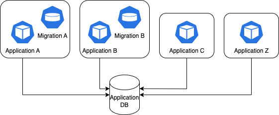

# The Story

## WhizKube Consult

Alice, Bob and you working togehter at WhizKube Consult. As a team, the 3 of you are responsible for supporting different customers with Kubernetes-related enquiries.

Your team leader Kate approaches you with a customer request and asks you to assist the customer.

The customer was running several applications on Kubernetes. These applications used a database. At first, the migrations were only performed when a single application was launched. Since another team also wanted to manipulate the data and the schema of the database, migrations were also performed when another application was launched as well.

Everything worked more or less stable, until the customer started to scale the application horizontally. Suddenly there were regular problems with the database migrations. For the client, the migrations seem to fail randomly.

The customer also provided a current architecture overview:

The client was frustrated and contacted Kate for help.

---

Alice, Bob and you consult about what to do:

*Alice:* Hey! I think the best thing would be to look at different ways of doing the migrations and then present them to the clients. I think there is a way to do it through the CD pipeline, but probably there are beter options as well.

*Bob:* It`s probably worth to look into the current architecture as well.

*Alice:* That's what I thought too. Let's start working on it.